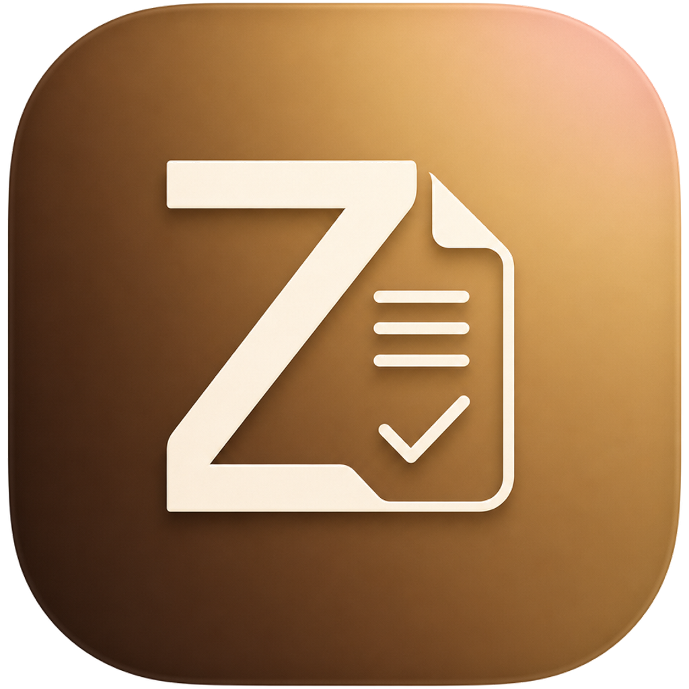
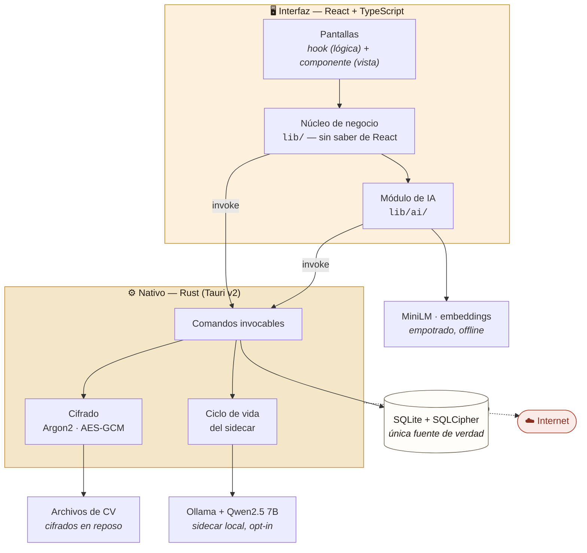

<div align="center">



# Zalent

**Gestor de CVs y talento con IA que funciona entero en tu ordenador.**

Búsqueda semántica, lectura automática de currículums y matching contra ofertas —
sin servidores, sin suscripción y sin que los datos salgan del equipo.

<!-- TODO(portfolio): sustituir por capturas reales. Ver docs/PORTFOLIO.md -->
<!--  -->

Tauri v2 · React · TypeScript · Rust · SQLite (SQLCipher) · transformers.js · Ollama

</div>

---

## El problema

Una PYME que contrata recibe cientos de currículums y acaba gestionándolos en
una carpeta compartida. Los ATS que resuelven esto (Greenhouse, Lever, Workable)
son caros, están sobredimensionados y —lo más importante— **exigen subir datos
personales de terceros a la nube de otra empresa**, con todo lo que eso implica
bajo el RGPD.

Zalent hace lo mismo que ellos en lo esencial, pero **local-first**: los CVs
nunca salen del ordenador.

## Qué hace

- **Lee los CVs solo.** Arrastras 200 archivos y salen fichas estructuradas
  (nombre, contacto, experiencia, estudios, idiomas). PDF, Word, y **PDFs
  escaneados vía OCR**.
- **Busca por significado, no por palabras.** Escribes *"gente con trato al
  público y algo de inglés"* y encuentra a quien puso *"atención al cliente"* —
  con el fragmento del CV resaltado como evidencia.
- **Puntúa contra una oferta.** Pegas una vacante y ordena a toda la base
  explicando el encaje y los huecos.
- **Pipeline por oferta**, notas con historial y etiquetas libres.
- **Aprende de ti**: los 👍/👎 reordenan los resultados hacia tu criterio.
- **Cifrado real en reposo** y herramientas de RGPD (borrado efectivo,
  anonimizado, exportación).

## Lo interesante por dentro

Tres problemas que costaron de verdad y cómo se resolvieron:

**1. Un LLM que no cabía en el navegador.**
La extracción por reglas tiene techo (puesto, estudios y habilidades se le
escapan). Se intentó meter un modelo generativo en el propio webview con
WebGPU y con WASM: **no fue un problema de potencia del equipo, sino de límites
de memoria que el navegador impone por diseño**. La solución fue mover la
inferencia al lado nativo — Ollama como *sidecar* de Tauri, arrancado y parado
desde Rust, invisible para el usuario.
→ [Diario, entradas 28-31](docs/DIARIO-APRENDIZAJE.md)

**2. Que la IA no invente datos sobre personas reales.**
Un LLM alucina con total seguridad (en las pruebas llegó a inventar *"165 años
de experiencia"*). Zalent no le cree: cada dato propuesto pasa por un
**validador de anclaje** que lo acepta solo si aparece literalmente en el texto
del CV. El modelo propone, el validador dispone — y se prefiere un hueco a una
mentira.
→ [`src/lib/ai/llm-validate.ts`](src/lib/ai/llm-validate.ts)

**3. Cifrar la base de datos sin poder cambiar de librería.**
`tauri-plugin-sql` no soporta SQLCipher. En vez de reescribir la capa de datos
se hizo un **fork propio del plugin** que aplica `PRAGMA key`, con la clave
derivada de la contraseña maestra (Argon2). La migración es reversible y
verificada: copia de seguridad → cifrar a fichero nuevo → comprobar que no
falta ninguna fila → y solo entonces reemplazar.
→ [`src-tauri/vendor/tauri-plugin-sql-cipher/`](src-tauri/vendor/)

## Arquitectura



El único proceso que Zalent no controla es el **sidecar de Ollama**, y aun así
lo arranca y lo cierra Rust: el usuario nunca lo ve ni tiene que instalarlo.

```
src/                  La cara — React + TypeScript
├─ lib/               Núcleo de negocio, sin saber de React
│  ├─ ai/             Todo lo de IA, aislado en su módulo
│  ├─ candidates.ts   CRUD, borrado en cascada, RGPD
│  └─ extract.ts      PDF / Word / OCR → texto
├─ screens/           Patrón hook (lógica) + componente (presentación)
└─ shell/             Navegación y tema

src-tauri/            El cerebro — Rust
└─ src/lib.rs         Comandos nativos, AES-GCM/Argon2,
                      ciclo de vida del sidecar de IA
```

**Dos IAs distintas, y conviene no confundirlas:**

| | Motor | ¿Offline? |
|---|---|---|
| Búsqueda semántica | MiniLM (embeddings) | ✅ Desde el primer arranque — viaja en el instalador |
| Extracción y redacción | Qwen2.5 7B vía Ollama | Requiere **una** descarga inicial (4,7 GB); después, sin red |

## Estado

Funcional y empaquetado: instalador de Windows probado de extremo a extremo,
174 tests, 0 errores de ESLint. Pendiente: firma digital del instalador y
actualizaciones automáticas (ambas de pago).

## Documentación

| Documento | Para quién |
|---|---|
| [`docs/MANUAL.md`](docs/MANUAL.md) | Quien **usa** la app. Se entrega con el instalador. |
| [`docs/DIARIO-APRENDIZAJE.md`](docs/DIARIO-APRENDIZAJE.md) | Quien la **construye**. 63 entradas de crónica + guía técnica. |
| [`CLAUDE.md`](CLAUDE.md) | Visión, stack y principios de arquitectura. |
| [`docs/PENDIENTES.md`](docs/PENDIENTES.md) | Lo que queda, por prioridad. |

## Ejecutar en local

Requisitos: Node.js, Rust (`rustup`) y las **Visual Studio C++ Build Tools**
(carga *"Desarrollo para el escritorio con C++"*). Para compilar con SQLCipher
hace falta además **Strawberry Perl**.

```bash
npm install
npm run tauri dev      # ventana de desarrollo
npm run tauri build    # instalador
npm test               # 174 tests
```

## Licencia

Código **visible para consulta y evaluación**, todos los derechos reservados
([`LICENSE`](LICENSE)). Es decir: puedes leerlo y estudiarlo, pero no copiarlo
ni reutilizarlo. Si te interesa algo de aquí para tu proyecto, escríbeme.

---

<div align="center">

Un producto de **CocoBrain** · Olaz, el coco con cerebro, es su mascota

</div>
